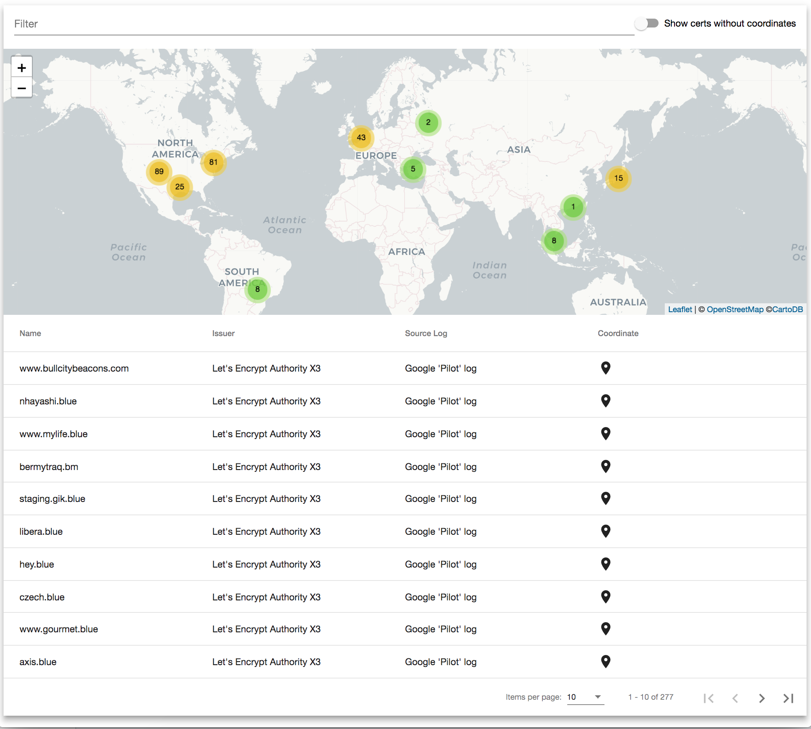

# Cert Stream Viz

Example full-stack single page web application created to visualize the [Certificate Transparency Log](https://www.certificate-transparency.org/what-is-ct) network. Inspired by [CertStream](https://certstream.calidog.io/), real-time certificate transparency log update stream. Using the [Java](https://github.com/CaliDog/certstream-java) library provided by [Cali Dog Security](https://medium.com/cali-dog-security).

## Features

* Filtering 
    * Simple text filter
    * Only certificates that can be geo located are shown. Clicking the toggle will show them in the table.
* Sorting table headers
* Map and table are kept in sync.
* 100% streaming

## Created using

* Angular 
* Spring Boot

## Prerequisites

* Java 8
* Node 9

## Getting Started
1. ./gradlew runBundle
2. Open Browser http://localhost:8080/ (tested with Chrome  67 and Firefox 60)

## Why?
Wanted to build a full reactive application using some of the popular frameworks in use today. I choose Spring Boot as I have traditionally used a Java stack of Jersey, Jackson, and HK2 or Node.js in the past, but wanted to see what all the buzz around Spring Boot was.

I started with the Jersey starter, but soon found the integration to be a bit clunky. So I decided to try the Spring's built in functionality for created rest services and then quickly found my way to the new Webflux framework. Webflux made me feel right at home with its reactive programming support. It made creating a streaming backend a very easy.

I have had some experience with Angular before, but wanted to experiment with Angular 6 with Angular Material, which I haven't used before.

---
**Dedicated:** I know its unusual to have a dedication on a code project, but I started work on this project and then my father in law suddenly died on May 24th, 2018. He worked on and lead some incredible technologies; TCAS (traffic collision avoidance system), Iridium satellites (satellite phones), Airfone (airplane phones, which lead to WiFi on airplanes), and many other amazing things. So after a few hard weeks I was to able to finish.

*Richard Hobby(1995-2018)*
